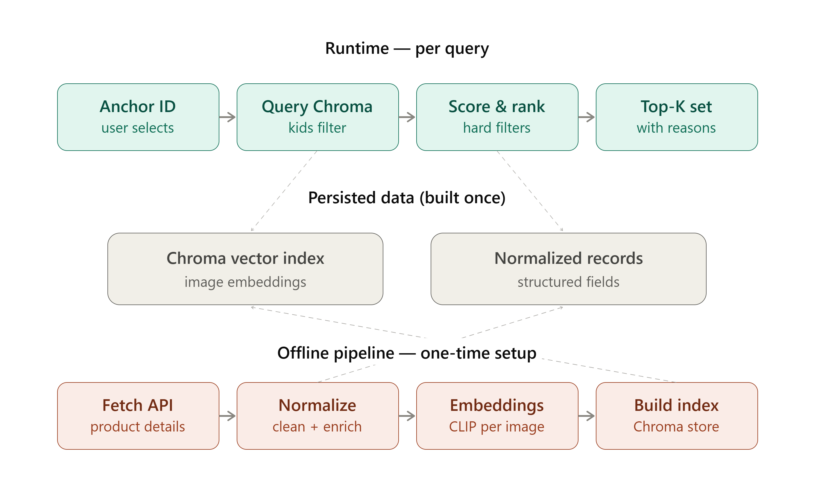

# BlueStone Matching Jewellery Set Recommender

Given a jewellery design, recommends complementary products (e.g. earrings
for a pendant, a ring for a necklace) to form a matching set — combining
visual similarity (CLIP embeddings), structured metadata, and business
rules.

Live demo: https://bluestone-aie-assignment.onrender.com  
(Note: Application is deployed on Free Tier, so there might be some Start-Up Time)

---

## Architecture



Offline: CSV of design IDs → fetch product API → normalize → LLM gender
fallback → download images → CLIP embeddings → Chroma vector index.

Runtime: anchor product → Chroma similarity search (pre-filtered by
is_kids) → hard filters (category, zone, gender) → weighted scoring →
rank + diversify by category → top-K with explanations → served via
FastAPI to the frontend.

---
## How It Works

1. **One-Time Steps**: fetch product data → normalize fields →
   fill gaps with an LLM where needed → generate image embeddings → index
   everything in a vector DB (Chroma).
2. **Runtime App** (deployed): given an anchor product, retrieve visually
   similar candidates from Chroma → apply hard filters → score on weighted
   criteria → rank → return top-K with explanations.

See [Architecture](#architecture) below for the full flow.

---

## Repository structure

```
config.py                       # settings: paths, API URLs, category rules
sampler.py                      # offline: CSV -> sample of design IDs
fetcher.py                      # offline: calls product API, caches responses
inspect_data.py                 # offline: reports field/category completeness
normalize.py                    # offline: raw data -> clean per-product record
enrich_gender.py                # offline: LLM fallback for ambiguous gender
download_images.py              # offline: downloads product images
generate_embeddings.py          # offline: CLIP embedding per image
build_vector_index.py           # offline: builds the Chroma vector index
data_loader.py                  # runtime: loads data, connects to Chroma
matching.py                     # runtime: retrieval, filters, scoring, ranking
api.py                          # runtime: FastAPI app (deployed)
static/index.html               # runtime: frontend UI
data/
    /normalized                 # needed at runtime
    /embeddings                 # needed at runtime
    /chroma_db                  # needed at runtime
    /raw                        # gitignored
    /images                     # gitignored
    /logs                       # gitignored
```

Only `config.py`, `data_loader.py`, `matching.py`, `api.py`,
`static/index.html`, and the three `data/` folders above are needed to run
the deployed app. Everything else is a one-time data-build step, kept in
the repo for reproducibility.

---

## Setup

**1. Clone the repo:**
```bash
git clone <your-repo-url>
cd bluestone_assignment
```

**2. Create a virtual environment and install dependencies:**
```bash
python -m venv venv
source venv/bin/activate      # or venv\Scripts\activate on Windows
pip install -r requirements.txt
```

**3. Run the app.** The repo already includes the precomputed dataset
(`data/normalized`, `data/embeddings`, `data/chroma_db`), so no data-build
step is needed — just start the server:
```bash
uvicorn api:app --reload
```
Open `http://127.0.0.1:8000` in your browser.

---

### Optional: rebuild the dataset from scratch

Only needed if you want to regenerate the data (e.g. with a different
sample size), not required to just run the app.

```bash
python sampler.py design_ids.csv --sample-size 100 --id-column design_id
python fetcher.py
python normalize.py
python enrich_gender.py        # needs GROQ_API_KEY in a .env file
python download_images.py
python generate_embeddings.py
python build_vector_index.py
```

### Optional: quick CLI testing (bypasses the UI)

```bash
python matching.py --design-id 433 --top-k 5
python matching.py                          # random anchor if no ID given
```

---

## Matching logic

**Hard Filters** (exclude candidates entirely):
- Same Category excluded (category names canonicalized, e.g. "Rings" and
  "PreSet Solitaire Rings" treated as one category)
- Same "Zone Group" excluded by default — necklace / pendant / mangalsutra
   are all worn in Neck, so for a given Necklace, Pendant and Mangalsutra will not be recommended in the Matching Set(toggle: `include_same_zone`)
- Gender must be compatible (unisex matches anything; Men/Women must match)
- Adult vs. Kids must match (filtered directly in the Chroma query)

**Soft-Scored Criteria** (weighted, summed into a final match score):

| Criterion | Weight | Why |
|---|---|---|
| Visual similarity (CLIP) | 0.30 | Captures design language/motif — nothing else covers this |
| Metal + finish match | 0.25 | Mismatched metal color is the most visually jarring mismatch |
| Gemstone compatibility | 0.20 | Diamond/colored/plain consistency matters for "set" feel |
| Price-tier closeness | 0.10 | A real business constraint |
| Collection match | 0.10 | Strong signal, but present on only ~24% of products |
| Occasion/tag overlap | 0.05 | Weakest, sparsest signal |

Weights are **manually reasoned, not learned** — no co-purchase/click data
was available to fit them against. Missing data (e.g. no collection on
either side) contributes 0, never a penalty.

Explanations are template-based (deterministic, from which criteria scored
highest), not LLM-generated — fast, free, reproducible.

---

## Where AI is Used

- **CLIP Embeddings** (`ViT-B-32`) — one per product image, compared via
  cosine similarity at query time. This is the visual/design-language
  signal, and the reason a vector DB (Chroma) is used for retrieval.
- **Groq (llama-3.1-8b-instant)** — text-only, used only to fill in gender when
  category + tags + design name give no clear signal. After deriving
  gender from structured fields first, only ~13/96 records needed this,
  and non-ring categories skip the LLM entirely (defaulted to "women" per
  observed catalog skew) — so the LLM call is a narrow fallback, not a
  bulk step.

---

## Key Assumptions

- Developed against a reproducible 96-product sample (not the full ~8k
  catalog) due to the timeframe; all code accepts sample size as a
  parameter and is written to scale without modification.
- 4 of 100 initially sampled design IDs failed with a transient upstream
  API error and were excluded.
- Category-pairing "strength" is not tiered (e.g. necklace+earrings isn't
  scored higher than ring+bracelet) — noted as a future improvement.
- Non-ring categories with ambiguous gender default to "women", based on
  observed catalog skew, not asserted as fact.
- Gemstone matching compares kind only (diamond/colored/solitaire/plain),
  not carat or clarity.
- Scoring weights are hand-reasoned, not learned from data.

---

## Known Limitations / Future Improvements

- Category-pairing strength could be tiered or learned from co-purchase data.
- Scoring weights are unvalidated against real outcomes — a learned ranking
  model would be the natural next step in production.
- Design/motif matching is currently implicit (via embedding similarity);
  adding zero-shot CLIP motif labels (e.g. "floral", "geometric") would make
  explanations more concrete.
- No automated recommendation-quality metric exists — no ground truth was
  available; outputs were reviewed manually throughout development.

---